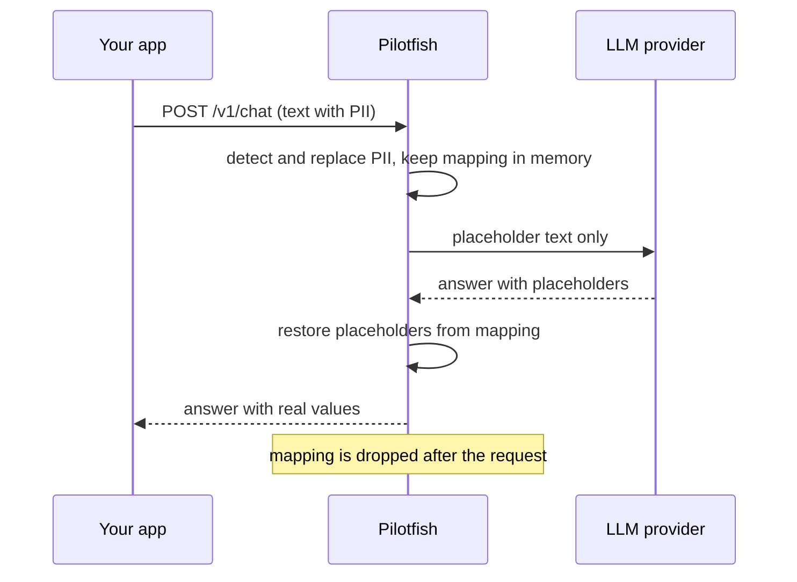

# How Pilotfish works

This page explains what happens to your data from the moment it enters Pilotfish until the answer comes back. It matches the code in `pilotfish/core.py` and `pilotfish/app.py` at version 0.1.0.

## The idea in one minute

An LLM does not need to know that your customer is *Anna* with email *anna@corp.io*. It only needs to know that there is a person and an email address, and that the same person is mentioned twice. So Pilotfish:

1. finds personal data in the text,
2. replaces each value with a stable placeholder such as `[EMAIL_1]`,
3. keeps the mapping `[EMAIL_1] → anna@corp.io` on your side only,
4. sends the placeholder version to the model,
5. swaps placeholders in the answer back to the real values.

## Components

| File | Responsibility | State | I/O |
|---|---|---|---|
| `pilotfish/core.py` | Detect, redact, restore | none | none |
| `pilotfish/app.py` | HTTP API, sessions, call to the LLM provider | in-memory sessions | network |

The core is deliberately pure: it takes a string and a dictionary and returns a string. This keeps it easy to audit, test, and reuse as a library.

## Request flow



With `/v1/redact` and `/v1/restore` the same steps happen in two separate calls, and the mapping is kept in a session between them.

## Detection

### Pipeline

For every detector in `DETECTORS`:

1. run its regular expression over the text,
2. discard matches that fail the detector's validator (if it has one),
3. collect the remaining matches as candidates `(start, priority, end, label)`.

Then candidates are sorted by start position, then by priority (the order of the `DETECTORS` list), then by end position. Pilotfish walks that list and **skips any candidate that overlaps an already accepted one**. This gives deterministic, non-overlapping spans.

### Detectors in 0.1.0

| Label | Pattern | Validator | Why a validator |
|---|---|---|---|
| `EMAIL` | `local@domain.tld` | none | pattern is specific enough |
| `CARD` | 14 to 19 digits with optional spaces or dashes | Luhn checksum | rejects arbitrary long numbers (order ids, timestamps) |
| `IBAN` | country code, 2 digits, groups of 4 | none yet | a mod-97 check is on the roadmap |
| `IP` | dotted IPv4 | none | |
| `PHONE` | optional `+`, digits, spaces, dashes, brackets | 9 to 15 digits | rejects dates such as `2024-01-15` |

The order matters. An IP address such as `192.168.1.10` also looks like a phone number to the phone pattern, but `IP` comes first in the list, so it wins on equal start positions. A 16-digit string that fails Luhn is not a card, and lookarounds in the phone pattern stop it from being cut into a shorter "phone number".

### What is not detected

Names, street addresses, company names, free-text identifiers such as "the patient in room 4". These need a language model (NER). See the [roadmap](roadmap.md).

## Placeholders and the mapping

- Format: `[LABEL_n]`, where `n` counts per label starting at 1.
- **The same value always receives the same placeholder** within one mapping. Two mentions of `anna@corp.io` both become `[EMAIL_1]`.
- Restoring uses one regular expression, `\[[A-Z]+_\d+\]`, and replaces each match with the stored value.
- A placeholder that is not in the mapping is **left untouched**. If the model invents `[EMAIL_9]`, you see `[EMAIL_9]`, never a wrong value.

### Known edge cases

| Case | Behavior today | Planned |
|---|---|---|
| The model rewrites a placeholder (`[email_1]`, `[EMAIL 1]`) | Not restored | Tolerant matching |
| The input already contains text like `[EMAIL_1]` | Treated as a normal placeholder on restore | Escape pre-existing brackets |
| Placeholder split across streamed chunks | Streaming not supported | Buffering |
| Very long input | Limited to 100,000 characters per request | Configurable |

## Sessions

Used by `/v1/redact` and `/v1/restore`.

- The first call to `/v1/redact` creates a session with a random 128-bit id (`secrets.token_urlsafe(16)`), so ids cannot be guessed.
- Passing the same `session_id` again reuses the mapping, which keeps placeholders consistent across a multi-turn conversation.
- A session lives 15 minutes from its last use. Expired sessions are purged on every call.
- An unknown or expired id returns `404`. Pilotfish never creates a session under an id chosen by the caller.
- Sessions are held in process memory. They are lost on restart and are not shared between instances.

## `/v1/chat`

The all-in-one endpoint.

1. Redacts every message with **one shared mapping**, so a value mentioned in two messages gets one placeholder.
2. Adds a short system prompt telling the model that placeholders are opaque and must be reused verbatim.
3. Calls the Anthropic Messages API with the key from the `x-provider-key` header.
4. Joins the text blocks of the answer and restores the placeholders.
5. Returns the text and the number of redacted entities. The mapping is garbage-collected with the request.

If the provider returns a non-200 status, Pilotfish answers `502` with only the status code. The provider's response body is not forwarded, so it cannot leak data back through an error message.

## Privacy and security properties

| Property | How it is achieved |
|---|---|
| The provider never sees original values | Redaction happens before the outbound request |
| No bodies in logs | The application does not log bodies. Start Uvicorn with `--no-access-log` |
| No key storage | The provider key is read from a header and used for one request |
| Bounded input | Pydantic limits text length and `max_tokens` |
| No oracle on sessions | Unknown and expired sessions return the same `404` |

### Threat model

**Protects against:** the LLM provider (or anyone who gets its logs or training data) learning identifiers that Pilotfish detected.

**Does not protect against:**

- values the detectors miss,
- information that identifies someone through context rather than through a value,
- a compromised host running Pilotfish, since the mapping is in its memory,
- you sending the original text to the provider by some other path.

Do not describe Pilotfish as anonymization. It is **pseudonymization**: the data can be re-identified by whoever holds the mapping, which under GDPR is still personal data in your hands.

## Extending detection

Add an entry to `DETECTORS` in `pilotfish/core.py`:

```python
("NATIONAL_ID", re.compile(r"\b\d{9}\b"), my_checksum_fn),
```

Order in the list is priority. Put narrow, validated patterns before broad ones. An NER-based detector (names, addresses) can be added as another source of spans in `find_spans`; the rest of the pipeline stays the same.

## Testing

```bash
pip install -e ".[dev]"
pytest
```

Current tests cover the round trip, placeholder reuse, false positives (dates, numbers failing Luhn), unknown placeholders, and the session API.