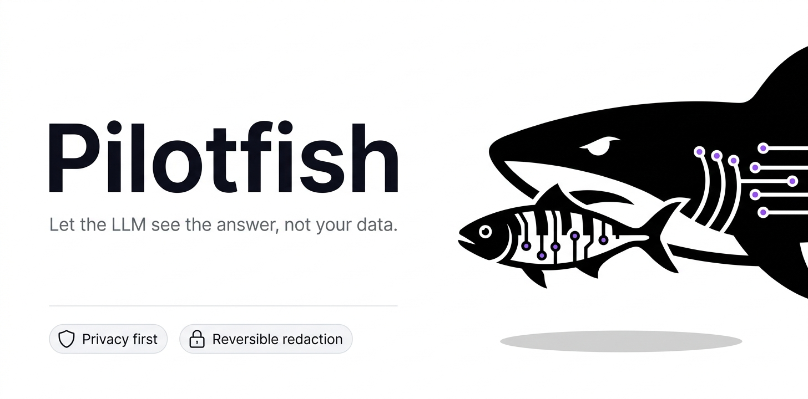

<p align="center">
  
</p>

<h1 align="center">sharkeyes-pilotfish</h1>

<p align="center">
  <b>Let the LLM see the answer, not your data.</b><br>
  A small privacy proxy that redacts personal data before it reaches an LLM and restores it in the response.
</p>

<p align="center">
  <a href="https://github.com/Ananas1kexe/sharkeyes-pilotfish/actions"></a>
  <a href="LICENSE"></a>
  
  
</p>

---

## What is it?

A pilot fish swims next to a shark and stays out of its way. Pilotfish sits next to your LLM calls: it swaps personal data for placeholders **before the prompt leaves your infrastructure**, and swaps the real values back into the answer.

```text
You send         Email anna@corp.io and call +972 54-123-4567
LLM receives     Email [EMAIL_1] and call [PHONE_1]
LLM answers      Done: I wrote to [EMAIL_1]
You get          Done: I wrote to anna@corp.io
```

The same value always gets the same placeholder, so the model can still tell who is who.

## Why Pilotfish

- **Privacy first.** Request and response bodies are never logged. The LLM provider only sees placeholders.
- **Reversible.** Unlike plain masking, you get the real values back in the answer.
- **Small and auditable.** The core is a single file with no I/O and no state. You can read it in one sitting.
- **Provider-agnostic core.** `redact` and `restore` are plain functions. The bundled `/v1/chat` endpoint targets the Anthropic API, and you can use the core with any other provider.
- **Self-hosted.** Run it as a container inside your own network. Your provider key is passed through and never stored.

## Quick start

### From source

```bash
git clone https://github.com/Ananas1kexe/sharkeyes-pilotfish.git
cd sharkeyes-pilotfish
pip install -e ".[dev]"
uvicorn pilotfish.app:app --no-access-log
```

### Docker

```bash
docker build -t pilotfish .
docker run -p 8000:8000 pilotfish
```

Interactive API docs are served at <http://localhost:8000/docs>.

## Usage

### As a library

```python
from pilotfish import redact, restore

mapping = {}
safe = redact("Mail anna@corp.io", mapping)   # "Mail [EMAIL_1]"

# ... send `safe` to any LLM, get `answer` back ...
answer = "Sent to [EMAIL_1]"

print(restore(answer, mapping))               # "Sent to anna@corp.io"
```

### As an HTTP API

**One call: redact, ask the model, restore**

```bash
curl -s localhost:8000/v1/chat \
  -H "content-type: application/json" \
  -H "x-provider-key: $ANTHROPIC_API_KEY" \
  -d '{
    "messages": [{"role": "user", "content": "Draft a reply to anna@corp.io"}]
  }'
```

The mapping lives in memory for this single request and is dropped afterwards.

**Two calls: use your own LLM client**

```bash
# 1. Redact
curl -s localhost:8000/v1/redact -H "content-type: application/json" \
  -d '{"text": "Mail anna@corp.io"}'
# {"session_id": "…", "text": "Mail [EMAIL_1]", "entities": 1}

# 2. Restore the model's answer
curl -s localhost:8000/v1/restore -H "content-type: application/json" \
  -d '{"text": "Sent to [EMAIL_1]", "session_id": "…"}'
# {"text": "Sent to anna@corp.io"}
```

Pass `session_id` to `/v1/redact` again to keep placeholders consistent across a conversation. Sessions expire after 15 minutes.

| Endpoint | Purpose | State |
|---|---|---|
| `POST /v1/chat` | Redact, call the model, restore | In memory, one request |
| `POST /v1/redact` | Replace PII with placeholders | In memory, 15 min TTL |
| `POST /v1/restore` | Put real values back | Reads the session |

## What it detects

| Type | Placeholder | Notes |
|---|---|---|
| Email | `[EMAIL_n]` | |
| Payment card | `[CARD_n]` | Luhn-checked, so random digit strings are ignored |
| IBAN | `[IBAN_n]` | |
| IPv4 | `[IP_n]` | |
| Phone | `[PHONE_n]` | 9 to 15 digits, dates are ignored |

Names and street addresses are **not** caught yet. Add an NER detector (Presidio, spaCy, GLiNER) as another entry in `DETECTORS` in [`pilotfish/core.py`](pilotfish/core.py).

## Privacy model

| What | Where it lives | How long |
|---|---|---|
| Original values | Your process memory | One request (`/v1/chat`) or 15 minutes (`/v1/redact`) |
| Request and response bodies | Nowhere, not logged | n/a |
| LLM provider key | Request header, passed through | Never stored |
| Placeholders | Sent to the LLM | Meaningless without the mapping |

Run the server with `--no-access-log` (the Dockerfile already does) and keep any reverse proxy in front of it from logging bodies.

## Limits

Please read this before using Pilotfish with regulated data.

- Detection is pattern-based and **probabilistic**. A value that does not look like a known pattern will pass through unredacted.
- Pilotfish lowers the chance that personal data reaches a third party. It is **not** a compliance guarantee for GDPR, HIPAA, PCI DSS or anything else.
- Context can still leak. A prompt that says "the CEO of our two-person startup in Haifa" identifies someone without containing a single detectable value.
- Streaming responses are not supported yet, because a placeholder can arrive split across chunks.
- The built-in session store is in memory. It does not survive restarts and does not scale across multiple instances.

## Roadmap

- [x] Regex detectors with validation (email, card, IBAN, IPv4, phone)
- [x] Reversible placeholders with consistent mapping
- [x] HTTP API and Docker image
- [ ] Pluggable NER detectors for names and addresses
- [ ] Multilingual detection (Russian, Hebrew, Arabic)
- [ ] Streaming support with placeholder buffering
- [ ] Redis session store with encryption at rest
- [ ] API-key authentication and rate limiting
- [ ] OpenAI-compatible and other provider adapters

## Development

```bash
pip install -e ".[dev]"
pytest
```

```text
pilotfish/
├── core.py     detectors, redact, restore (no I/O, no state)
└── app.py      FastAPI service
tests/
```

## Security

Found a vulnerability? Please do not open a public issue. Use GitHub's **Report a vulnerability** button in the Security tab, or see [SECURITY.md](SECURITY.md).

## License

Pilotfish is licensed under the [GNU AGPL-3.0](LICENSE). You can read, run, modify and self-host it for free. If you run a modified version as a network service, you must publish your changes under the same license.

If AGPL does not fit your use case, for example when embedding Pilotfish into a closed-source product, a **commercial license** is available. Contact: `YOUR-EMAIL`.

## Contributing

Issues and pull requests are welcome. Because the project is dual-licensed, contributors are asked to sign a short CLA on their first pull request.

---

<p align="center">
  Part of <b>SharkEyes</b>: security first, privacy friendly.
</p>